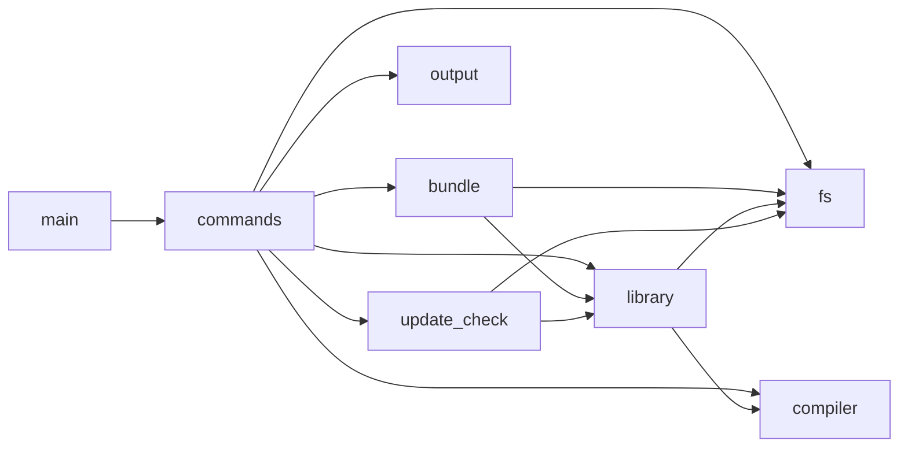

# risundle 設計方針

[spec.md](spec.md) が機能仕様 (何を作るか) を定めるのに対し、本書は内部設計の方針 (どう作るか) を残す。コードからは読み取りにくい判断の記録であり、メンテナンスや機能追加の際に「なぜこうなっているか」を辿るための常設ドキュメントとして維持する。

## 依存は内向き一方向

クリーンアーキテクチャ (原義) が言うのは「ソースの依存を一方向に保て」だけで、同心円の図や層の数・名前は一例にすぎない。安定したもの (ライブラリという概念や tree-shaking) に、揮発的なもの (tree-sitter ・ コンパイラ ・ JSON ・ clap) が依存する形にし、逆流させない。層を切る基準は「将来差し替わるか」の一点。

## モジュール構成

```
src/
  main.rs            配線・argv 振り分け
  cli.rs             clap 定義
  config.rs          .risundlerc.toml の読み取り
  commands/          サブコマンドの受け口 (library.rs / bundle.rs)
  library/           登録済みライブラリのドメイン
    registry.rs      登録の実処理 (登録・再登録・自動セットアップ・自動移行)
    tags.rs          tags.json のデータと永続化
    local.rs         $LOCAL 上の配置 (LocalStore)
    hash.rs          内容ベースの集約ハッシュ
    dummy.rs         維持ライブラリのダミー生成
    identifiers.rs   tree-sitter による識別子抽出
    testutil.rs      テスト専用の共有補助 (ソース木・ストア・偽コンパイラの組み立て。cfg(test) 限定)
  fs/                汎用ファイル走査 (walk / source / relpath / which)
  compiler.rs        コンパイラへの問い合わせ (絶対パス解決・システム include パス検出)
  output.rs          標準出力への書き込み (broken pipe を黙って正常終了させる)
  update_check.rs    risundle 本体の更新チェック (crates.io 問い合わせ・キャッシュ)
  bundle/            tree-shaking の純粋ロジック (コンパイラ起動・IO は commands/bundle.rs)
    inventory.rs     登録ライブラリの突き合わせ (-I 組立・逆引き・分類・ハッシュ検証)
    linemarker.rs    プリプロセス出力の linemarker 解析と行の出所追跡
    detect.rs        logos による識別子検出 (文字列・コメントはスキップ)
    prune.rs         -M 出力の解析と、集合差による不要ヘッダー特定
    rewrite.rs       不要行の削除とダミー pragma の #include 復元
```

依存は内向き一方向で、循環しない。矢印は「依存してよい相手」で、ここに無い依存は持たない (`fs`・`compiler`・`output` は何にも依存しない終端):



各モジュールの役割と、そこに置く理由は次のとおり。

- `fs` は何にも依存しない走査ユーティリティで、`library` と `bundle` (と `update_check`) が共有する。PATH 上の実行可能ファイル探索 (`which`) も、コンパイラ解決と更新チェックの両方が使うためここに置く。
- `compiler` も同じ立ち位置の共有の道具。コンパイラへの問い合わせは登録 (システム include パスの検出) とバンドル (警告時の照合) のどちらにも属さないので、`library` に埋めず `fs` と並べる。
- `output` も同様に依存ゼロの共有の道具。標準出力への書き込みは登録にもバンドルにも属さない横断的な関心事なので、`commands/` の複数箇所 (`bundle.rs`・`library.rs`) が共有する。
- `library` は走査を `fs` に、コンパイラへの問い合わせを `compiler` に委ね、登録済みライブラリの表現・永続化・登録処理 (`registry`) を担う。
- `bundle` は `library` の tags.json を逆引きに使うため `library` に依存する。
- `identifiers` ・ `dummy` は登録専用なので `library` 内に置く。`bundle` は使わない。
- `update_check` は `library` サブコマンド実行時にだけ発動する、risundle 本体の更新チェック。`library::local::LocalStore` で `$LOCAL` のパス解決を借りるが、登録処理そのものとは無関係な横断的関心事なので `library` の外に独立させる。バンドルの実行経路 (`commands/bundle.rs`) には依存されない。

## IO の置き場所は処理の性質で決める

副作用のない計算は入出力を受け口 (`commands/`) へ追い出し、副作用が目的の処理は入出力ごとドメインが抱える。

- バンドルは、入力の文字列から出力の文字列を作る計算が核。だからコンパイラ起動や標準出力は `commands/bundle.rs` に任せ、`bundle/` を純粋な関数として保つ。テストも理解もしやすくなる。
- ライブラリの登録は、ダミーのファイル群を作り tags.json を書くという、副作用そのものが目的の処理。守るべき純粋な核が無いので、入出力ごと `library/registry.rs` が担う。

両者で置き場所が違うのはちぐはぐではなく、処理の性質に合わせた使い分け。画面表示は、時間のかかる処理の途中経過 (標準エラー) を実処理の側が出し、ユーザーへの最終結果 (標準出力) を受け口が出す、と分担する。

## std は単一 dir ではなく、コンパイラの全システム include パス

標準ライブラリのヘッダーは 1 ディレクトリに収まらない。C++ 標準 (`/usr/include/c++/14`) のほか、コンパイラ組み込み (`immintrin.h` 等)・アーキ依存 (`bits/stdc++.h` 等)・C ライブラリに分散する。バンドルは `-nostdinc` でこれら全てを探索対象から外しダミーへ倒すため、ダミー集合が 1 dir 分しか無いと、そこに住まない直接 include (`immintrin.h` / `bits/stdc++.h`) が解決できず壊れる。

そこで `add-std` はコンパイラを起動して `-v` の探索パス一覧を取得し (`compiler::system_includes`)、全 dir を 1 つのダミーツリーへ集約する (相対パス衝突は復元 `#include` が同一になるので無害)。`std` だけ登録手順が他と異なるため、汎用 `add` から分けて専用コマンドにしている。

## std はコンパイラ単体ではなく「認識集合」を持つ

「ツールが唯一の現在コンパイラをグローバルに握る」のは避ける。コンパイラはプロジェクト単位 (`.risundlerc.toml` / `--compiler`) で変わりうる環境側の関心事だからだ。代わりに std は **認識しているコンパイラの集合** (`compilers`) を持ち、`add-std` を繰り返すと集合へ加算し、集合全コンパイラのシステム include を 1 つのダミーツリーへ統合する。和集合がどのコンパイラのヘッダーもカバーするので、どれでバンドルしても解決でき背反が起きない。

照合の表記揺れを避けるため、コンパイラは登録時もバンドル時も同じ規則で実体の絶対パスへ正規化する (`g++` も `/usr/bin/g++` も同一に収束)。この正規化は登録とバンドルが共有するので `compiler.rs` (`compiler::resolve`) に置く。バンドル時は対象コンパイラが認識集合に無ければ警告し (フェイルファスト)、`add-std <それ>` を促す。検証は集合への所属チェックだけで、強制はしない (未登録コンパイラでのバンドルはコンパイル時に明示エラーになる)。

## 規模に合わせて、あえてやらないこと

CLI ツール (非テストコード約 3000 行) では、抽象を足すほど薄いディレクトリと配線が増えてかえって読みにくい。依存方向さえ守れば足りるので、次は入れない。

- `domain` ・ `infra` のような抽象的な層名を作らず、ドメイン名でそのまま分ける。
- trait と DI は入れない。tree-sitter やコンパイラの差し替えが現実の要求になったら、その境界にだけ足せばよい。
- tags.rs はデータ構造と JSON 読み書きを分けない。同居の方が読みやすく、schema_version でスキーマ進化を吸収できている。

## tree-shaking は過剰検出側に倒す

C++ の厳密な依存解析は難しいので、識別子名の照合で近似する。余分に拾う分には安全 (取りこぼしだけが依存漏れ = コンパイルエラーになる) なので、メンバ名やマクロ名まで拾っても気にしない。

例外は namespace 名だけ。`atcoder` のような名前はほぼ全ファイルに現れ、定義として登録すると逆引きで大半のヘッダーが依存扱いになって tree-shaking が効かなくなる。過剰検出が裏目に出る唯一のケースなので、namespace 名は集めない (中のメンバは個別に拾う)。詳細は identifiers.rs の `NAME_NODES` を参照。

## 実装ファイルは「実装先の名前」で引く

宣言と実装が別ファイルに分かれたライブラリでは、識別子名の照合だけでは依存を辿れない依存が生じる。典型は演算子オーバーロードで、利用側は `f * g` と書くだけで `operator*=` というトークンは現れず、実装ファイル (`operator*=` の本体だけを置いたファイル) が逆引きに引っかからない。過剰検出側に倒す方針でも、これは「取りこぼし」なので放置できない。

素朴な対策 (必要ファイルを include するファイルを全部残す / 識別子検出を残存コード全体へ広げる) はいずれも巻き込みが連鎖して tree-shaking をほぼ無効化する (Nyaan's Library で実測)。決め手は、クラス外実装が `void FormalPowerSeries<mint>::set_fft()` のように**実装先の名前を必ず自分で書いている**という観察。そこで登録時にこの名前 (クラス外修飾定義の修飾側・明示的特殊化の主テンプレート名) を `implements` として別に記録し、バンドル時に「必要ファイルが定義する名前を実装先に持つファイルも必要」と引く。識別子の逆引きと同型の引き方をもう 1 種足し、増えなくなるまで反復する。これは「余分に残すのは安全」の一貫であり、実装先を静的に特定できない依存 (自由関数の演算子だけのファイル等) は依然取りこぼすが、その場合も提出時のコンパイル/リンクエラーとして顕在化する。

## エラーと警告の線引き

ユーザーの指定が不正・無効だったとき、エラーで止めるか警告で続行するかは次の 2 基準で決める。

- **閉じた語彙はエラー、開いた語彙は警告**。`.risundlerc.toml` のキー名 typo は `deny_unknown_fields` で即エラーにする。risundle 自身のスキーマは静的に正誤が決まる閉じた語彙だからだ。一方 keep のライブラリ ID は、正誤がマシン状態 (登録済みか) に依存する開いた語彙である。設定ファイルはリポジトリにコミットされるのにライブラリ登録は `$LOCAL` に住むため、clone 直後は未登録 ID が構造的に生じる。エラーにするとその状態のバンドルを全部塞ぐので、事実 (指定が no-op であること) と処方 (`library list` / `library add`) を警告で告げるに留め、結果はコンパイル時に顕在化させる (未登録コンパイラの警告と同じ扱い)。
- **命令形はエラー、宣言形は警告**。`library show <id>` や `delete <id>` の未登録 ID は即エラー。その場の意図の直接目的語であり、続行しても他にやることがない。keep は複数の実行にまたがる宣言的設定なので、警告して動く出力を作る方が価値がある。

警告は「行き止まり」を作らない: 正当な操作 (登録する・config から消す・typo を直す) で必ず消えるものだけを出し、抑制フラグは増やさない。exit code も変えない (`oj t && risundle ... && oj s` のようなチェーンを警告で止めない)。

## tags.json のスキーマ変化は黙って吸収する

tags.json はライブラリ実体から決定的に再生成できるキャッシュであり、可搬性を持たない (`path` は絶対パス)。だから schema_version がバイナリの現行と食い違うのは「ユーザーの落ち度」ではなく「risundle の都合」であり、ユーザー操作を要求すべきでない。バンドル時に食い違う登録をライブラリ実体から黙って作り直す (`std` の初回自動登録と同じ発想)。

この非対称が肝: **ユーザーの内容が変わった (ハッシュ不一致) は確認させ、risundle の形式が変わった (スキーマ不一致) は黙って直す**。前者は意味的な事象なので `update` か `--no-check` の判断をユーザーに委ね、後者はキャッシュの世代交代なので自動で吸収する。`update`・`add-std` は登録を作り直すコマンドなので、スキーマ非依存の中核 (`Registration` = `path` + 任意の `compilers`) だけを検証せず読んで回復する。`list`・`show` は読み取りに徹し、再生成せず読める情報だけ出す。
